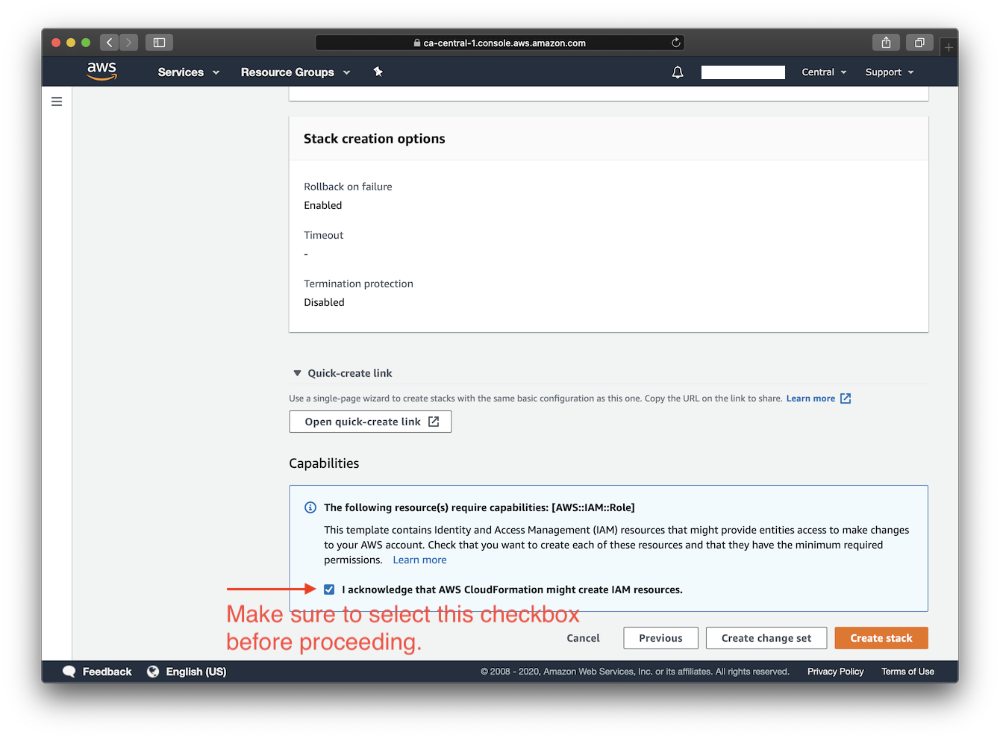
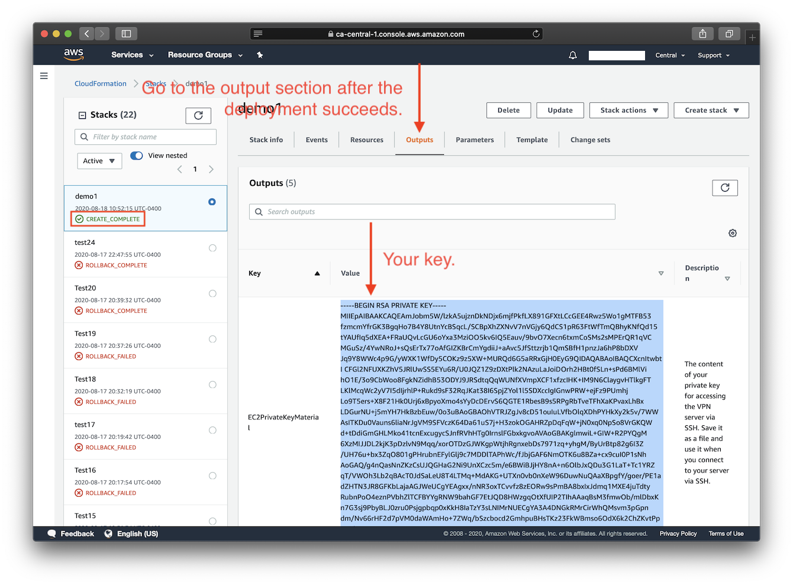

# 使用 CloudFormation 在 Amazon EC2 上部署（测试版）

*其他语言版本: [English](README.md), [简体中文](README-zh.md).*

> **注：** 此部署模板目前为 **测试版**，在使用时你可能会遇到错误。如果遇到问题，请创建一个新的 Issue。

使用这个模板，你可以在 Amazon Elastic Compute Cloud（Amazon EC2）上快速搭建一个 IPsec VPN 服务器。在继续之前，请参见 EC2 [定价细节](https://aws.amazon.com/cn/ec2/pricing/on-demand/)。在部署中使用 `t2.micro` 服务器实例可能符合 [AWS 免费套餐](https://aws.amazon.com/cn/free/) 的资格。

可用的自定义参数：

- Amazon EC2 实例类型
> **注：** 在任意 AWS 区域中，某些此模版提供的实例类型可能不可用。比如说 `m5a.large` 可能无法在 `ap-east-1` 区域部署。（仅为假设）在其情况下，您会在部署过程中遇到此错误：`The requested configuration is currently not supported. Please check the documentation for supported configurations`. 新建成的 AWS 区域更容易造成此问题，因为这些新区域提供的实例类型不是很多。
- VPN 服务器的操作系统（Ubuntu 20.04/18.04/16.04，Debian 9）
> **注：** 在 EC2 上使用 Debian 9 映像之前，你需要先在 AWS Marketplace 上订阅：[Debian 9](https://aws.amazon.com/marketplace/pp/B073HW9SP3)。
- 你的 VPN 用户名
- 你的 VPN 密码
- 你的 VPN IPsec PSK（预共享密钥）

> **注：** \*不要\* 在值中使用这些字符： `\ " '`

确保使用 **AWS 账户根用户** 或者有 **管理员权限** 的 **IAM 用户** 部署此模板。

右键单击这个 [**模板链接**](https://raw.githubusercontent.com/hwdsl2/setup-ipsec-vpn/master/aws/cloudformation-template-ipsec)，并将它保存到你的计算机上的一个新文件。然后在 ["创建堆栈" 向导](https://console.aws.amazon.com/cloudformation/home#/stacks/new)中将其作为模板源上传。

在步骤 4，你需要确认（选择）此模板可以创建 IAM 资源。

点击下面的图标开始：

要指定一个 AWS 区域，你可以使用导航栏上你的帐户信息右侧的选择器。当你在最后一步中点击 "create stack" 之后，请等待堆栈创建和 VPN 安装完成，可能需要最多 15 分钟。一旦堆栈的部署状态变成 **"CREATE_COMPLETE"** ，你就可以连接到 VPN 服务器了。单击 **Outputs** 选项卡以查看你的 VPN 登录信息，然后继续下一步：[配置 VPN 客户端](../README-zh.md#下一步)。

## 常见问题

部署后如何通过 SSH 连接到服务器？

在部署后，Ubuntu 实例的默认用户名是 **ubuntu**，而 Debian 则是 **admin**。Amazon EC2 不允许用户使用 SSH 密码访问新创建的实例。用户必须创建“密钥对”来作为 SSH 访问的凭据。

此模板在部署期间为你生成一个密钥对，并且在成功创建堆栈后，其中的私钥将在 **Outputs** 选项卡下以文本形式提供。

如果要通过 SSH 访问 VPN 服务器，则需要将 **Outputs** 选项卡中的私钥保存到你的计算机上的一个新文件。

> **注：** 在保存到你的计算机之前，你可能需要修改私钥的格式，比如用换行符替换所有的空格。

## 作者

版权所有 (C) 2020 [S. X. Liang](https://github.com/scottpedia)

## 屏幕截图

