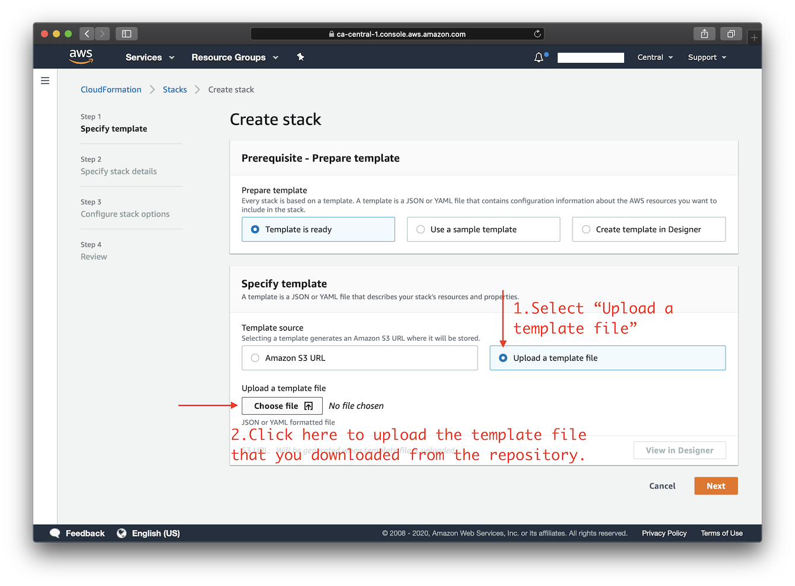

# Deploy to AWS (Beta)

> **Note:** The AWS deployment template is still in **BETA** phase. You may encounter failures during the deployment. In that case, please let us know the issue.

This template will create a fully-working IPSec/L2TP VPN server on AWS (Amazon Web Service). Please make sure to check the [pricing details](https://aws.amazon.com/ec2/pricing/on-demand/) of Virtual Machine on EC2 before starting the launch sequence.

You can also use `t2.micro` instance as your server for your deployment, which is free of charge within the first year since your AWS account is registered. For more information on AWS free usage tier, go to [this page](https://aws.amazon.com/free/).

## Available Customization Parameters:

- AWS EC2 Instance Type
- OS for your VPN Server (Ubuntu16.04, Ubuntu18.04 or Debian9-stretch)
> **Note:** To use Debian9 on EC2, to need to [**subscribe**](https://aws.amazon.com/marketplace/pp/B073HW9SP3) first.
- Your VPN username
- Your VPN password
- IPSec PSK (pre-shared key)

> When choosing your username and password, do not enter special characters like `" ' \`.

Make sure to do this with an **AWS ROOT ACCOUNT** or an **IAM ACCOUNT** with **ADMINISTRATION PRVILEGE**. 

Download the template file [**here**](https://raw.githubusercontent.com/scottpedia/setup-ipsec-vpn/master/aws/cloudformation-template-ipsec) and upload it as the template source in the stack creation wizard.

At step 4, make sure to confirm that this template may create IAM resources.

Click the icon below to initiate the launching sequence.

Make sure the deployment is successful before going to [Next Step: Configure VPN Clients](https://git.io/vpnclients).

> **Note:** You need to wait for at least 3 minutes after the stack is shown as **"CREATE_COMPLETE"**, before you can connect to the server with a VPN client. That's for the installation script to finish.

# FAQs

How to connect to the server via ssh after deployment?

  
AWS does not allow users to access the instances with an SSH password. Instead, users are instructed to create "key pairs", which are used as credentials to access the instances via SSH. 

The template here generates a key pair for you during the deployment, and that will be available as plain texts in the **"Output"** section after the stack is successfully created.

You need to note down that key file if you want to later access the VPN server via SSH. 

## Author

Copyright (C) 2020 [S. X. Liang](https://github.com/scottpedia)

## Screenshots

